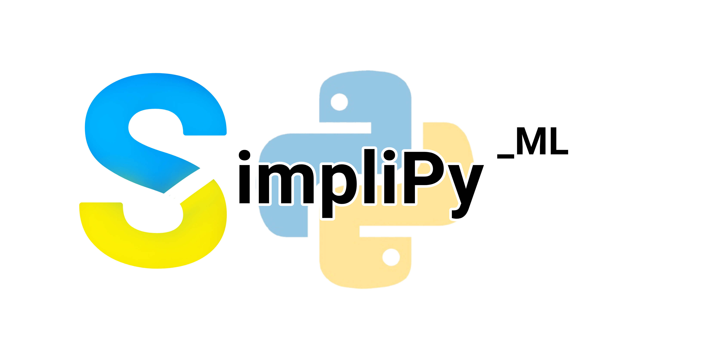

## SimpliPy_ML

- This is an open-source python library for those who wants to make models fast and easy.

- Users need to install at least Python 3.8.10 version on their machine in order to run modules/libraries/frameworks that
SimpliPy_ML relies on.

## How to install?
You can run the following command in the terminal in your project directory:

This library is not yet available on PyPi so "pip install SimpliPy_ML" won't work. So, run the command in your project's directory:
```bash
pip install git+https://github.com/KarkAngelo114/SimpliPy_ML.git
```

## Library overview:

A Python package called SimpliPy_ML was created to enable anyone to train and construct a model without the need for complex programming.  Based on the well-known machine learning frameworks Tensorflow and Keras, the name suggests that it is designed to "simplify machine learning in Python." Developers usually code everything, even using the library or framework, in contrast to working with tensorflow and/or keras for a CNN model.  Making your own model and implementing it are made "simple" with SimpliPy_ML.  Since some of the functions required to complete these tasks are already pre-coded and ready to use for SIMPLE TASKS THAT INVOLVED MACHINE-LEARNING, SimpliPy_ML will make it easier for you in just a few lines of syntax with its own utilities to extract and load datasets, train, create, and export.

## Features
This library includes:
- training and building CNN models as well as other models
- has evaluator function to evaluate model's performance
- function to load datasets (images in a folders or a CSV files)
- exporter function to export models (example in .tflite formats)
- retrain an existing model (soon)

## Pre-requisites
Pre-requisites:
- must have at least Python 3.8.10 installed
- has installed the following libraries:
    - pillow
    - tensorflow
    - keras
    - scikit-learn
    - numpy
    - matplotlib
    - pandas
    - seaborn
    - onnx
    - keras2onnx
    - onnxruntime

Or alternatively, after installation of SimpliPy_ML, create a python script and run the following code:

```python
## Python:

from SimpliPy_ML.tools import installer

# This will install all libraries that SimpliPy_ML depends on
installer.package_install('*')
```

## WHAT'S NEW??
 - can now visualize the model's performance


"Have fun building stuffs :D" - Kark Angelo (The lead developer)